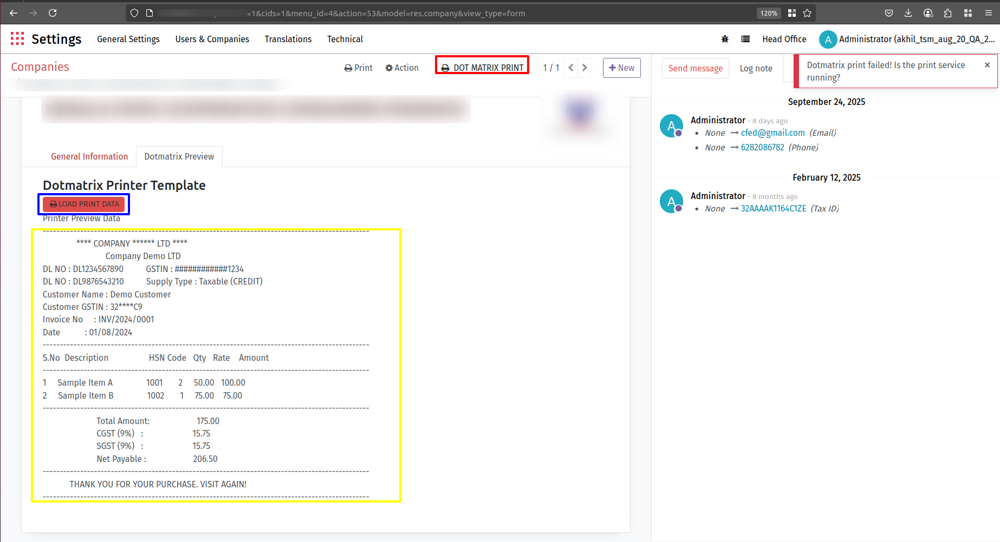

# 🖨️ Printer Proxy (Dotmatrix + Thermal)

A lightweight **Flask-based API service** to send raw text/img directly to a Dotmatrix Printer from **Odoo (v14/v15+)** or any system via HTTP requests.  
Supports **Windows, Linux, and macOS** 🪟🐧🍎

## Supports:
- 🧾 Dotmatrix printers (RAW text)
- 🔥 Thermal printers (PDF)

## 🚀 Features

- ✅ Simple API to receive and print data  
- 🧾 Compatible with **Odoo v14 (Python 3.7.3)** and **v15+ (Python 3.8.20)**  
- 🌍 Cross-platform support (**Windows, Linux, macOS**)  
- 🔒 CORS enabled (accessible from browsers or Odoo)  
- 🛠️ Easily extendable for network printers or direct printer APIs  
- Single proxy for multiple printer types
- POS-style auto printing

---

## 📸 Screenshots / Demo

- Printer Proxy in action  

---

## 📥 Installation

### 📌 Clone/Download

1. url :-https://github.com/AKHILTP/dotmatrix-printer-proxy

git clone https://github.com/AKHILTP/dotmatrix-printer-proxy

2. download the ZIP and extract to:

C:/ in Windows

~/home/ in Linux/Ubuntu

## 🟦 Windows Setup Instructions

#If Python is not installed:

1. Download Python 3.8.20 from the official website or run the provided installer.
2. **Ensure you add Python to your system PATH during installation.**

or

- Alternatively, run `install_python.bat` by double-clicking it. This will install Python 3.8.20 silently and add it to your PATH.

#After installation, open a CMD and verify with:

command: python3 --version

## 🟦 Steps

1.  **OPen CMD: open path to file final path of folder**
      eg: cd dotmatrix-printer-proxy

2. **Create & Activate a Virtual Environment**:

   - python -m venv venv
   - venv\Scripts\activate

3. **Install Required Packages**:

   - pip install -r requirements.txt
   - python -m pip install --upgrade pip 
      (if raise: not upgraded pip warning)

   <!-- wsl --install
   sudo apt update
   sudo apt install -y python3-full python3-venv poppler-utils

   ** FOr go to local disc cpath.
   📂 Windows C: drive path in WSL 
   command :- cd /mnt/c
   cd <path of the proxy folder> open
   then.
   python3 -m venv venv
   source venv/bin/activate
   
   <!-- sudo apt install -y python3-pip libcups2-dev cups -->
   <!-- pip3 install pycups

   in window cmd prompt. --> 
   
4. **For pdf2image support Download Poppler for Windows**:

   https://github.com/oschwartz10612/poppler-windows/releases
    - download zip latest
    STEP 2: Extract Poppler
    Note: popler file name can have version (C:\poppler) 
      eg: C:\popplerpoppler-25.12.0
      and verify You should now have:
         C:\popplerpoppler-25.12.0\Library\bin\pdftoppm.exe
         ⚠️ pdftoppm.exe must exist, otherwise pdf2image will fail.

   STEP 3: Add Poppler to PATH (IMPORTANT)
      1️⃣ Press Windows key(W) + R →
         Type:
            sysdm.cpl
         Press Enter

      2️⃣ Open Environment Variables window
      Press Windows key(W) + R →
      Type:
         systempropertiesadvanced

         Go to Advanced tab (system properties)

         Click Environment Variables

      3️⃣ Edit PATH

         Under System variables (bottom box):
         
         1. Find Path 
            look for variable name "Path" and double-click on PATH

         2. Select it

         3. Click New

         4. Paste this:
            C:\poppler-25.12.0\Library\bin

      5- Click OK → Restart PowerShell / CMD
   
   🔹 STEP 4: Verify Poppler
      Open PowerShell -  
      How to open PowerShell?:
         ✅ Method 1
            1. Press Windows key
            2. Type: 
               PowerShell
            3. Click Windows PowerShell

         ✅ Method 2
            1. Press Windows + R

            2. Type:
               powershell

            3. Press Enter
      Verify Poppler (Copy-Paste this)
         pdftoppm -h
      ✅ If Poppler is installed correctly, you will see:
         pdftoppm version xx.xx
         Usage: pdftoppm [options] PDF-file ...

5. **For thermal print to support image file**:
   
   - pip install pywin32 python-escpos
   - pip install python-escpos pillow pdf2image pyusb
   <!-- - brew install poppler -->

##
5. **🌐 Thermal Print – Network Printer (Recommended)**:

✅ Method 1: Printer Self-Test Page (BEST)

Almost all POS thermal printers support this.

How to Find Printer IP & Port
- Turn OFF printer

- Hold FEED button

- Turn ON printer

- Release after printing starts

📄 The printed slip will show:

IP Address : 192.168.1.120
Subnet     : 255.255.255.0
Gateway    : 192.168.1.1
Port       : 9100

✅ Method 2: Printer Utility / Driver (Windows)

Most TVS / Epson printers install a utility:

Examples:

TVS Utility

EpsonNet Config

XPrinter Tool

Open utility → Network Settings → IP Address

👉 Use this IP in Odoo/other softwrae application
additionally
Use this CONFIG in software application/Odoo

→ printer_type pass as → network
→ pdf_base64: <BASE64_PDF_STRING>",
→ paper_width: 80/58 mm

6. **🌐 Thermal Print – USB**:

Notes

vendor_id and product_id must be hex values

Example:

USB\VID_0525&PID_A700 shown in Hardware lds in printer harware properties
check through Device manager -> network printer and scanners.
→ vendor_id = 0x0525
→ product_id = 0xA700

👉 Use this CONFIG in software application(odoo)
additionally
→ printer_type pass as → usb
→ pdf_base64: <BASE64_PDF_STRING>",
→ paper_width: 80/58 mm

7. **Start the Flask Application**:

      * Double-click on `start.bat` in the proxy folder.
      for shortcut for easy running can add to desktop
      * **Do not close the CMD terminal** as it keeps the server running.

---------------

## 🟦 Linux Setup Instructions

1.  **OPen CMD: open path to file final path of folder**
      eg: cd dotmatrix-printer-proxy

2. **Make the installation script- run it**:

   - chmod +x install_python.sh
   - ./install_python.sh

3. **Create & Activate a Virtual Environment**:

   - python3 -m venv venv
   - source venv/bin/activate

4. **Install Required Packages**:

   - pip install -r requirements.txt
   - pip install python-escpos

5. **Ensure CUPS is Installed and Printer is Not Paused**:

   - sudo apt install cups

   * Make sure:

     * The `lp` command is installed.
     * The printer is configured and not paused.

6. **For thermal print to support image file Install CUPS & Poppler**:
   
   - sudo apt install cups poppler-utils

7. **Start the Flask Application**:

   - chmod +x start.sh
   - ./start.sh
-----------------------------------------------------------------------

## For developer using this Printer for Dotmatrix
## 🛠️ API Usage

* **Endpoint:** `http://localhost:8000/dotmatrix/print`

* **Method:** `POST`

* **Headers:** `Content-Type: application/json`

* **Body:**
Dotmatrix Printing
POST /dotmatrix/print
EG:
  json
  {
    "printer_data": "Your raw text data to print"
  }

## For developer using this Printer for Thermal
* **Endpoint:** `http://localhost:8000/thermal/print`

* **Method:** `POST`

* **Headers:** `Content-Type: application/json`

* **Body:**
Thermal Printing – USB
USB\VID_0525&PID_A700 shown in Hardware lds in printer harware properties
json
EG:
{
  "pdf_base64": "<BASE64_PDF_STRING>",
  "paper_width": 80
  "printer_type": "usb",
  "vendor_id": "0x0525",
  "product_id": "0xA700"
}

Thermal Printing – Network
json
EG:
{
  "pdf_base64": "<BASE64_PDF_STRING>",
  "paper_width": 80
  "printer_type": "network",
  "ip": "192.168.1.120",
  "port": 9100
}

## ⚠️ Common Errors & Solutions

### ❌ "Invalid base64 / Incorrect padding"
✔ Ensure `pdf_base64` is a **pure base64 string**, not file size or filename  
✔ Do NOT send `"23.81 KB"` or `"invoice.pdf"`

---

### ❌ "Missing vendor_id / product_id"
✔ USB printing requires **hex values**  
✔ Example:

## 📬 Support

For any issues or feature requests, please open an issue on the [GitHub repository](https://github.com/AKHILTP/dotmatrix-printer-proxy/issues).